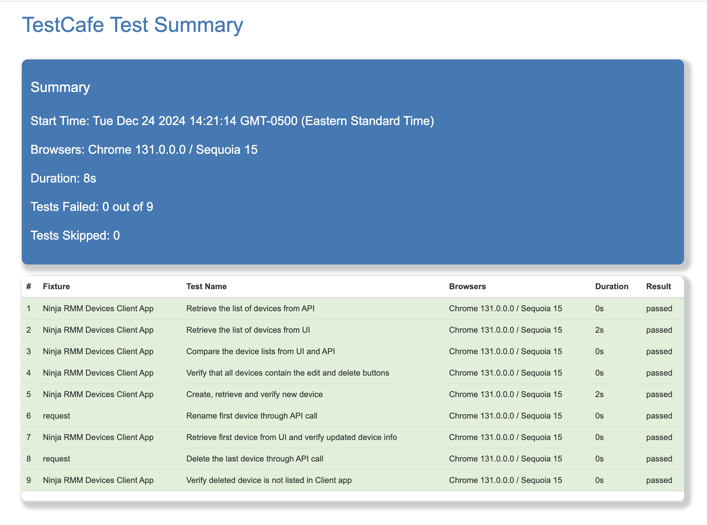

# TestCafe Test Automation Sample

## Running Tests

Execute `npm run start` 

This command will start the **server app** and the **client app** and automatically run all tests under the **tests/e2e** folder defined in [server.js](server.js) file (line 73)

## HTML Report Sample

