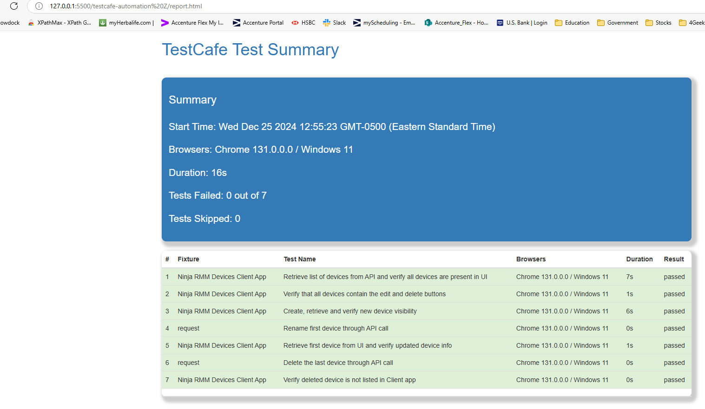

# TestCafe Automation Testing Framework
This is a robust UI and API testing framework built using [TestCafe], [JavaScript], and [Node]. It supports environment configurations via dotenv, data generation with faker, and MFA handling with otplib. The framework includes GitHub Actions integration for CI/CD.

## Links
- **TestCafe**: https://devexpress.github.io/testcafe 
- **UI**:  https://github.com/Yastrenky/devices-clientapp
- **Server**: https://github.com/NinjaRMM/devicesTask_serverApp

## 1. Environment Setup
 - **Node.js**: TestCafe requires Node.js version 12 or higher. Install it from the [Node.js Official Website](https://nodejs.org/). 
- **npm or Yarn**: A package manager to install TestCafe and its dependencies. ## 2. TestCafe Installation

## 2. TestCafe Installation 
You can install TestCafe globally or as a project dependency.
 - **Install TestCafe globally**: ```npm install -g testcafe ``` 
- **Or for a local project**: ```npm install testcafe --save-dev ```

## 3. Browsers Ensure the following supported browsers are installed on your machine: 
- Chrome, Firefox, Edge, Safari, or any Chromium-based browser. 
For **headless testing**, ensure the headless browser binaries (like chromium) are available.

## 4. Editor/IDE Any modern text editor, such as: 
- **VS Code**, **WebStorm**, or others with support for JavaScript/TypeScript syntax highlighting and linting.

## 5. Optional Tools
- **ESLint**: To enforce code quality for your test scripts.
- **Reporting Plugins**: Add reporters like `testcafe-reporter-spec` or `testcafe-reporter-html` for better insights:
    ```
    npm install testcafe-reporter-html --save-dev
    ```
## 7. System Requirements

- **Operating System**: Windows, macOS, or Linux.
- **Memory and CPU**: Adequate resources to run browser instances and execute tests smoothly.

## Installation and Running

```bash
git clone https://github.com/ZekeriyaOtumlu/TestCafe_Automation/tree/master
cd testcafe-automation Z
npm install
```


## HTML Report Sample

